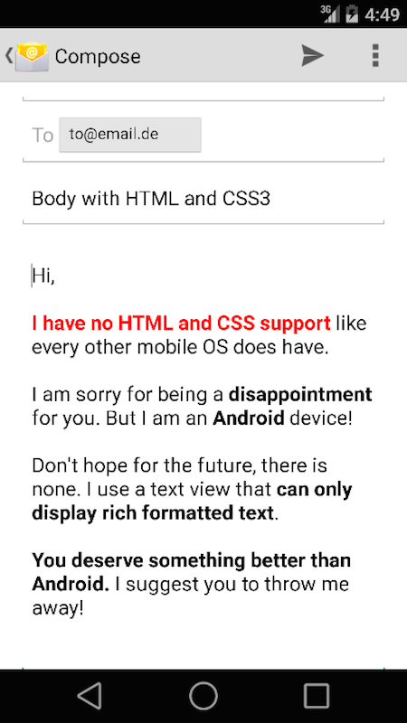

The plugin provides access to the standard interface that manages the editing and sending an email message. You can use this view controller to display a standard email view inside your application and populate the fields of that view with initial values, such as the subject, email recipients, body text, and attachments. The user can edit the initial contents you specify and choose to send the email or cancel the operation.

Using this interface does not guarantee immediate delivery of the corresponding email message. The user may cancel the creation of the message, and if the user does choose to send the message, the message is only queued in the Mail application outbox. This allows you to generate emails even in situations where the user does not have network access, such as in airplane mode. This interface does not provide a way for you to verify whether emails were actually sent.

```bash
cordova plugin add https://github.com/katzer/cordova-plugin-email-composer.git@0.8.2
```

#### Methods

##### `open(email)`

| Param        | Type           | Detail  |
| ------------ |----------------| --------|
| email        | `Object`      | Options to configure the Action Sheet |

> | Options     | Type           | Detail  |
> | ----------  | ---------------| --------|
> | to          | `String Array` | Email addresses for TO field |
> | cc          | `String Array` | Addresses for CC field |
> | bcc         | `String Array` | Addresses for BCC field |
> | attachments | `Array`        | File paths or base64 data streams |
> | subject     | `String`       | Subject of the email |
> | body        | `String`       | Email body (for HTML, set isHtml to true) |
> | isHtml      | `String`       | Indicats if the body is HTML or plain text |


 

#### Example

```javascript

module.controller('ThisCtrl', function($cordovaEmailComposer) {

 $cordovaEmailComposer.isAvailable().then(function() {
   // is available
 }, function () {
   // not available
 });

  var email = {
    to: 'max@mustermann.de',
    cc: 'erika@mustermann.de',
    bcc: ['john@doe.com', 'jane@doe.com'],
    attachments: [
      'file://img/logo.png',
      'res://icon.png',
      'base64:icon.png//iVBORw0KGgoAAAANSUhEUg...',
      'file://README.pdf'
    ],
    subject: 'Cordova Icons',
    body: 'How are you? Nice greetings from Leipzig',
    isHtml: true
  };

 $cordovaEmailComposer.open(email).then(null, function () {
   // user cancelled email
 });
});
```