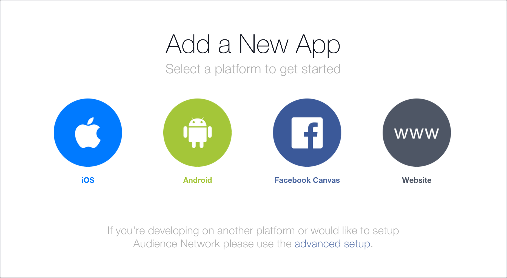
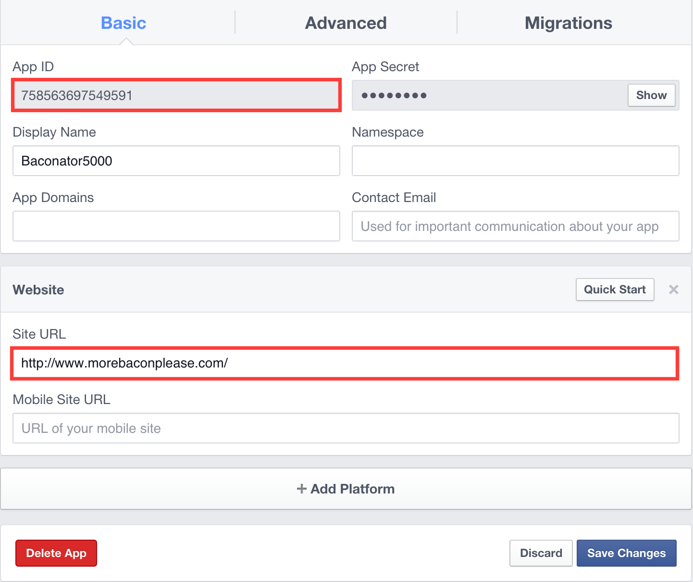

<div class="anchor-row">
  <h3><code>$cordovaFacebook</code></h3>
  <div class="button-row">
    <a class="btn-anchor" href="https://github.com/driftyco/ng-cordova/blob/master/src/plugins/facebook.js">Source</a>
    <a class="btn-anchor" href="https://github.com/Wizcorp/phonegap-facebook-plugin">Official Docs</a>
  </div>
  <div class="icon-row">
    <i class="icon ion-social-apple"></i>
    <i class="icon ion-social-android"></i>
  </div>
</div>

The Facebook Connect plugin to obtain access to the native FB application on iOS and Android. This plugin is not simple to install so make sure to check out the official docs.

#### Pre-Install

To use the FB plugin, you first have to create a new Facebook App inside of the Facebook developer portal at [https://developers.facebook.com](https://developers.facebook.com/).

[](http://developers.facebook.com/)

Retrieve the `App ID` and `App Name`, which will be required to setup your cordova app and for web-development.

[](https://developers.facebook.com/apps/)


#### iOS Install

Download the repo from [https://github.com/Wizcorp/phonegap-facebook-plugin](https://github.com/Wizcorp/phonegap-facebook-plugin). Then type in the following commands in your Terminal.


```bash
cordova platform add ios

cordova -d plugin add /Users/your/path/here/phonegap-facebook-plugin --variable APP_ID="123456789" --variable APP_NAME="myApplication"
```

**[Check out the more complete docs for iOS install](https://github.com/Wizcorp/phonegap-facebook-plugin/blob/master/platforms/ios/README.md)**

#### Android Install

Installing the FB plugin requires a lot of pre-configuration.

Configure the project with your FB app id in the `res/values/facebookconnect.xml` file. For example:

```xml
<resources>
    <string name="fb_app_id">123456789</string>
    <string name="fb_app_name">TEST</string>
</resources>
```

Then, type in your terminal the following commands:

```bash
cordova platform add android

cordova -d plugin add https://github.com/phonegap/phonegap-facebook-plugin.git --variable APP_ID="123456789" --variable APP_NAME="myApplication"

android update project --subprojects --path "platforms/android" --target android-19 --library "CordovaLib"

android update project --subprojects --path "platforms/android" --target android-19 --library "com.phonegap.plugins.facebookconnect/FacebookLib"

cd platforms/android/

ant clean

cd com.phonegap.plugins.facebookconnect/FacebookLib

ant clean

open -e AndroidManifest.xml

// change your minSdkVersion and your targetSdkVersion to your environment settings for me it was:
// <uses-sdk android:minSdkVersion="14" android:targetSdkVersion="17" />

ant release

cd ../../../..

cordova build android
```

**[Check out the detailed docs for Android](https://github.com/Wizcorp/phonegap-facebook-plugin/blob/master/platforms/android/README.md)**


#### Web Development

To use the FB plugin during your browser development, set the `$cordovaFacebookProvider` in your `app.config` module:

```javascript
// Only required for development in browser, not cordova!
module.config(function($cordovaFacebookProvider) {
  var appID = 123456789;
  var version = "v2.0"; // or leave blank and default is v2.0
  $cordovaFacebookProvider.browserInit(appID, version);
});
```

This will allow you to use Facebook in your application through the same API as the cordova plugin.

To allow web-access through your app in the development stage, you may have to go into the Facebook Developer portal and set the `Site URL` to your localhost server (eg: `http://localhost:8100/`). The page to configure these settings can be found at at [https://developers.facebook.com/apps/{Your App ID}/settings/](https://developers.facebook.com/apps/{Your App ID}/settings/).

[](https://developers.facebook.com/apps/{Your App ID}/settings/)


#### Methods

##### `login(permissions)`

| Param        | Type           | Detail  |
| ------------ |----------------| --------|
| permissions  | `String Array` | A string array of permissions your app will require. EG: `["public_profile", "email"]` |

> **Returns**  `Object` with user information, such as id, lastName


##### `showDialog(options)`

| Param        | Type           | Detail  |
| ------------ |----------------| --------|
| options  | `Object` | A JSON object with 3 keys: `method`, `link`, `caption`. Each value is of `String` type |


##### `api(path, permissions)`

| Param        | Type           | Detail  |
| ------------ |----------------| --------|
| path         | `String`       | The Facebook API path to query. EG: `me`, `me/photos`, `search?q={your-query}` |
| permissions  | `String Array` | A string array of permissions your app will require. Set permissions to `null` to stop the Facebook App from opening again. |


##### `getLoginStatus(message)`

Check if the user is currently logged in. If they are already logged in, there is no need to login again, and the `api` method can be called.

##### `getAccessToken(message)`

Retrieves the Access Token of the current logged-in session.

##### `logout(message)`

Logout the user out of Facebook.


#### Example

```javascript
module.controller('MyCtrl', function($scope, $cordovaFacebook) {

  $cordovaFacebook.login(["public_profile", "email", "user_friends"])
    .then(function(success) {
      // { id: "634565435",
      //   lastName: "bob"
      //   ...
      // }
    }, function (error) {
      // error
    });


  var options = {
    method: "feed",
    link: "http://example.com",
    caption: "Such caption, very feed."
  };
  $cordovaFacebook.showDialog(options)
    .then(function(success) {
      // success
    }, function (error) {
      // error
    });


  $cordovaFacebook.api("me", ["public_profile"])
    .then(function(success) {
      // success
    }, function (error) {
      // error
    });


  $cordovaFacebook.getLoginStatus()
    .then(function(success) {
      /*
      { authResponse: {
          userID: "12345678912345",
          accessToken: "kgkh3g42kh4g23kh4g2kh34g2kg4k2h4gkh3g4k2h4gk23h4gk2h34gk234gk2h34AndSoOn",
          session_Key: true,
          expiresIn: "5183738",
          sig: "..."
        },
        status: "connected"
      }
      */
    }, function (error) {
      // error
    });

  $cordovaFacebook.getAccessToken()
    .then(function(success) {
      // success
    }, function (error) {
      // error
    });

  $cordovaFacebook.logout()
    .then(function(success) {
      // success
    }, function (error) {
      // error
    });

});
```
